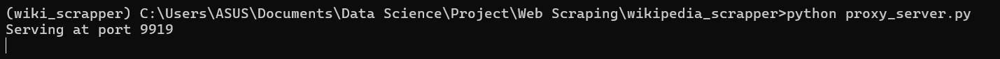
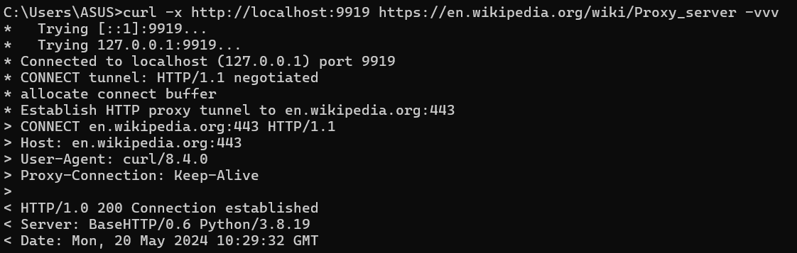
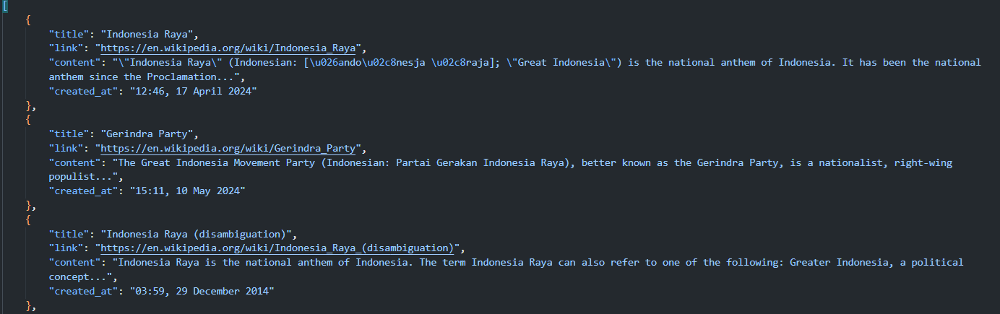
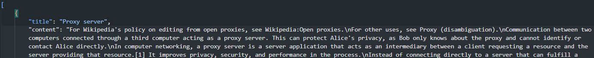
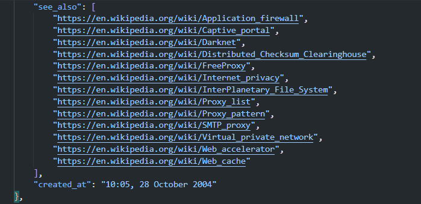

# Wikipedia Scrapper
Wikipedia scrapper adalah kumpulan kode yang bertujuan untuk mendapatkan hasil *phrase search* dalam Wikipedia dan ekstrak informasi dari kumpulan link Wikipedia.

## Asumsi
Dalam pengerjaan wikipedia scrapper ini ada beberapa asumsi,
1. Link URL relevan hanya diambil dari bagian *See Also* dalam laman Wikipedia, ini ditujukan agar URL yang diperoleh masih relevan dengan laman tersebut,
2. Link URL relevan akan diambil secara rekursif,
3. Web scrapper menggunakan browser Chrome melalui *chromedriver* yang dapat didownload dan diletakkan pada folder `browser/`

## Petunjuk Instalasi
1. Download Chromedriver dengan mengikuti petunjuk pada laman berikut ([How to download Chromedriver for Selenium](https://www.automationtestinghub.com/download-chrome-driver/)), pastikan versi Chromedriver sesuai dengan versi Google Chrome di komputer.
2. Simpan file `chromedriver.exe` dalam folder `browser/`
3. Di dalam file `.env` terdapat variabel `PROXY_URL=http://localhost:9919`, nilai ini dapat diubah ke link proxy yang diinginkan. Ini ditujukan untuk menjalankan kode `proxy_server.py`
4. Buat Python *environment* baru (bisa menggunakan *Anaconda* atau *venv*) lalu install *packages* yang diperlukan pada file `requirements.txt` dengan menjalankan kode berikut:
    ```pip install -r requirements.txt```

## Petunjuk Penggunaan Web Scrapper
1. Jalankan kode di bawah dalam terminal
    ```python proxy_server.py```
    Jika berhasil dijalankan, maka akan keluar output sebagai berikut:
    

    Apabila di-test dengan menjalankan kode berikut dalam terminal,
    ```curl -x http://localhost:9919 https://en.wikipedia.org/wiki/Proxy_server -vvv```
    maka akan keluar hasil sebagai berikut
    

    Pastikan bahwa proxy URL yang diberikan pada *command* curl sesuai dengan nilai `PROXY_URL` dalam file `.env`
2. Jika ingin mendapatkan hasil pencarian {phrase}, maka jalankan kode berikut dalam terminal
    * Apabila tidak ingin menggunakan proxy URL, maka gunakan kode berikut:
    ```sh run_scrapper.sh -p {phrase}```
    * Apabila ingin menggunakan proxy URL, maka gunakan kode berikut:
    ```sh run_scrapper.sh -p {phrase} -u {PROXY_URL}```
    * Sebagai contoh, setelah menjalankan kode ini dalam terminal:
    ```sh run_scrapper.sh -p "Indonesia Raya" -u http://localhost:9919```
    maka akan keluar file bernama `Indonesia Raya_%Y_%m_%d_%H_%M_%S.json` dalam direktori yang sama
    

3. Jika ingin mendapatkan informasi konten dari kumpulan link yang diberikan (`URL_LINKS`), pastikan `URL_LINKS` mengikuti format berikut:
    * Jika hanya 1 URL wikipedia, maka "{URL_LINK_1},"
    * Jika lebih dari 1 URL wikipedia, maka "{URL_LINK_1},{URL_LINK_2},{URL_LINK_3},"
    * Sebagai contoh, "https://en.wikipedia.org/wiki/Proxy_server,https://en.wikipedia.org/wiki/Transport_Layer_Security,"

    Apabila format sudah sesuai, maka jalankan kode berikut dalam terminal
    * Apabila tidak ingin menggunakan proxy URL, maka gunakan kode berikut:
    ```sh run_scrapper.sh -l {URL_LINKS}```
    * Apabila ingin menggunakan proxy URL, maka gunakan kode berikut:
    ```sh run_scrapper.sh -l {URL_LINKS} -u {PROXY_URL}```
    * Sebagai contoh, setelah menjalankan kode ini dalam terminal:
    ```sh run_scrapper.sh -l "https://en.wikipedia.org/wiki/Proxy_server,https://en.wikipedia.org/wiki/Transport_Layer_Security", -u http://localhost:9919```

    maka apabila proses ini dibatalkan atau telah selesai, akan keluar file bernama `Proxy_server.json` sebagai berikut:
    
    
    beserta URL yang relevan (jika ada)
    